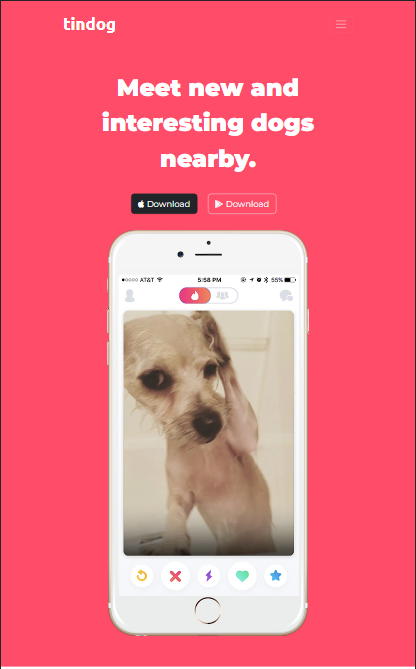
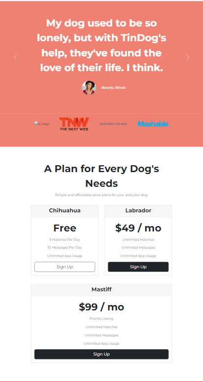
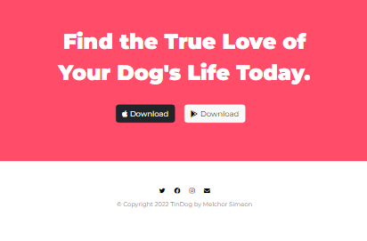

# TinDog
A tinder like website but for Dogs!

# About TinDog
This is a home page web design for TinDog. Here it provides the end details to the user such as pricing, contacts, and even the download page of the application.

# Tools Used
The main framework used in building the TinDog website is Bootstrap5 and its components like Carousel, Card, Buttons, Navbar etc. It also used HTML5, CSS3 and Google Fonts and Font Awesome.

# Screenshots

